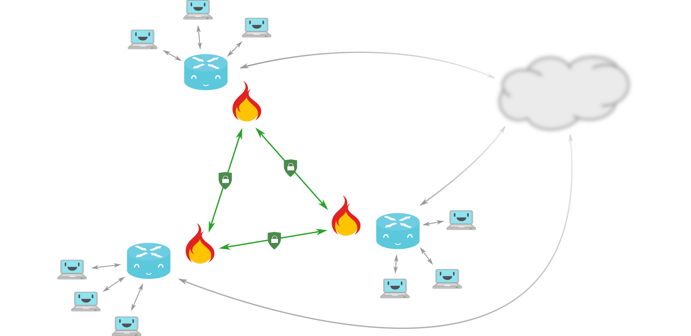

#   

🚧 🚧 🚧 🚧

**Vita is a high-performance IPsec VPN gateway designed with medium and large
network operators in mind.** It is written in a high-level language (Lua) and
achieves high performance via networking in userspace, i.e. bypassing the
kernel network stack.

## Project goals

- Provide a low-cost, open source solution to network traffic encryption at
  scale
- Support stand-alone operation as well as SAs established by third-party
  software such as StrongSwan
- Be as fast as possible on generic x86 CPUs, handle 10 Gbps line rate at 60
  byte packets and more
- Avoid vendor lock-in and complex mandatory dependencies
- Keep it all simple, maintainable, and modular
- Use strong, modern cryptographic primitives and protocols

## WARNING:

> Vita is in its early “tech-demo” stage of development and not ready for
> production yet!

## Features

- ~3 Mpps (or ~5 Gbps of IMIX traffic) per core on a modern CPU
- Runs on commodity hardware
- Implements IPsec for IPv4 and IPv6, specifically
  *IP Encapsulating Security Payload* (ESP) in tunnel mode
- Uses optimized AES-GCM 128-bit encryption based on a reference
  implementation by *Intel* for their AVX2 (generation-4) processors
- Automated key exchange and rotation, with perfect forward secrecy (PFS)
  (audit needed)
- Can act as a pure data-plane and consume SAs established by other means
- Dynamic reconfiguration via YANG RPCs (update routes while running)
- Strong observability: access relevant statistics of a running Vita node
- Written in Lua, a simple, high-level programming language and x86 assembly

## Documentation

- [Usage](https://github.com/inters/vita/blob/master/src/program/vita/README)
  — manual page for Vita’s command line interface
- [Configuration](https://github.com/inters/vita/blob/master/src/program/vita/README.config)
  — detailed description of Vita’s configuration language

## Getting started

Vita runs on any modern Linux/x86-64 distribution, but requires a compatible
network interface card (currently *Intel* chipsets i210, i350, and 82599) as
well as CPU support for
[AES-NI](https://en.wikipedia.org/wiki/AES_instruction_set) and
[AVX-2](https://en.wikipedia.org/wiki/Advanced_Vector_Extensions#Advanced_Vector_Extensions_2).
Important note: Snabb needs Linux to be booted with `iommu=off` for its device
drivers to function.

    $ git clone https://github.com/inters/vita
    $ cd vita
    $ RECIPE=Makefile.vita make -j
    $ sudo src/vita --help

Setting `RECIPE=Makefile.vita` causes a release build to be built (as opposed
to a test build.)

The `vita` binary is stand-alone, includes useful auxiliary applications (like
[snabb top](https://github.com/inters/vita/tree/master/src/program/top) and
[snabb pci_bind](https://github.com/inters/vita/tree/master/src/program/pci_bind)),
and can be copied between machines.

For example, to install Vita and the Snabb monitoring tool on the local
machine:

    $ sudo cp src/vita /usr/local/bin/vita
    $ sudo ln -s vita /usr/local/bin/snabb-top

## Benchmarking

End-to-end benchmarking procedures are documented in
[vita-loadtest.md](https://github.com/inters/vita/tree/master/src/program/vita/vita-loadtest.md).

## Deployment

Vita is a high-performance L3 VPN gateway you can use to interconnect your
networks. Vita acts as a tunnel between your local, private network and any
number of remote Vita gateways. With it, nodes spread across your outposts can
communicate with each other with confidentiality and authenticity ensured at
the network layer.

Vita is probably more efficient at encapsulating traffic than your application
servers. You can free cycles for your application by offloading your packet
encryption and authentication workload to Vita.

A Vita network can be as small as two nodes with a single route, and as large
as you like. For each pair of Vita gateways, a separate secure tunnel (*route*)
can be established—“can be” because a Vita network does not need to be a full
mesh, instead arbitrary hierarchies are supported on a route-by-route basis.
Each route uses a pre-shared super key that is installed on both ends of the
route. These keys need to be configured only once, and only need renewal when
compromised, in which case the breach will affect only the route in question.
The actual keys used to encrypt the traffic are ephemeral, and negotiated by
Vita automatically, with no manual intervention required.

Deploying Vita is easy, and not invasive to your existing infrastructure. It
can be as simple as adding an entry to the IP routing table of your default
gateway, to ensure that packets to destinations within your private network are
routed over an extra hop: the Vita gateway. Whether Vita forwards the
encapsulated packets back to your default gateway, or directly to your modem
depends on your setup, and is freely configurable.

To configure a Vita route, you need to specify the address prefix of the
destination subnetwork, and the public IP address of the target Vita gateway
(in addition to the pre-shared key). At the other end, you specify the source
prefix and gateway address in symmetry. You can even add and remove routes
while Vita is running, without affecting unrelated routes.

## Powered by

[Snabb](https://github.com/snabbco/snabb) is a simple and fast packet
networking toolkit with a wonderful community.

## Sponsored by

[NLnet](https://nlnet.nl) funded Vita development in 2018/2019 with their
generous donation. 🙇‍♂️
